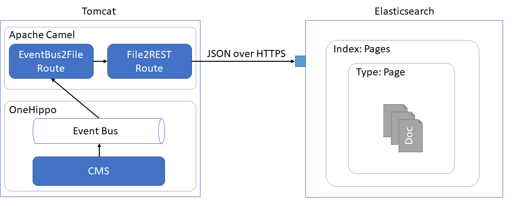
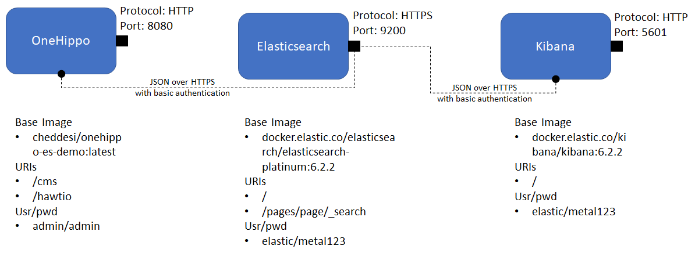

# OneHipp and Elaticsearch integration containerized demo
This project is fully containerized demo of Integrating OneHippo CMS with Elasticsearch as indexing platform.
## About the OneHippo integration with Elasticsearch
Following diagrams represents the integration approach followed in this demo.



## About the container setup
Follow diagram presents the services part of this demo pack.



## Pre-requisites
This demo setup was tested with Docker Toolbox for windows on Windows 10 OS.
Should be usable on Docker for Mac or Docker for Windows as well.

Following setting must be enabled on docker machine to run elasticsearch in production mode.
```sh
docker-machine ssh default
sudo sysctl -w vm.max_map_count=262144
exit
```
### Important Notes
* Allocate enough RAM to the docker machine. 4GB is recommended.
* Mount the current directory as a shared folder to Docker virtual machine, Elasticsearch requires the certificates accessible from a volume.

## Running the demo
1. Clone the git repo to local machine
```sh
git clone https://github.com/cheddesi/onehippo-es-docker-demo.git
```
2. Navigate to the directory that contains docker-compose.yml file.
```sh
cd onehippo-es-docker-demo
```
3. Run the containers
```sh
docker-compose up -d
```
4. Check whether the containers started successfully or not
```sh
docker ps
```
You can check the logs of individual containers with following commands
```sh
docker logs es01
docker logs kibana01
docker logs hippo01
```
_Note that it would take around 2-5 minutes for the hippo01 container to come-up._

## Appendix
* [Recorded Demo](others/Demo.mp4)
* Links to git repos
  * https://hub.docker.com/r/cheddesi/onehippo-es-demo/
  * https://github.com/cheddesi/camel-events-support
* Links to helpful articles
  * https://www.onehippo.org/library/search-engine-integration/external-search-engine-integration.html
* Instructions to generate own certs